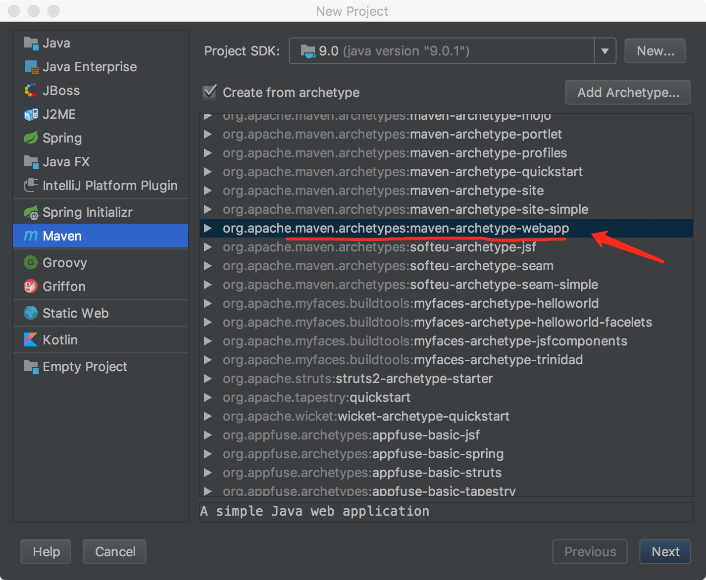
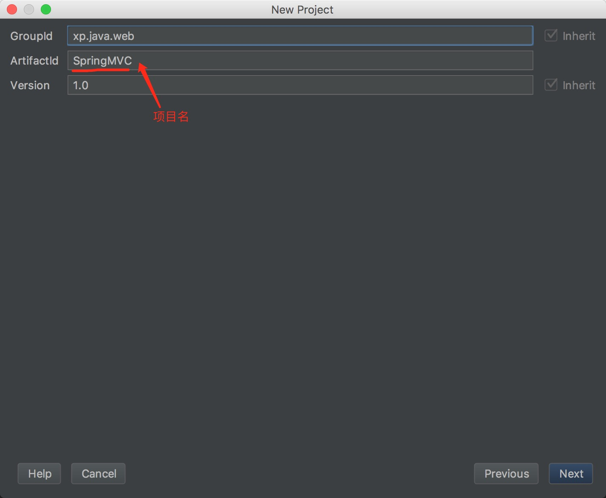
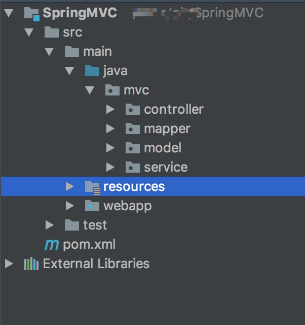

# 一步一步配置 SpringMVC

## 1. 新建mvn项目
<div align=center></div>
<br>
<br>
## 2. 输入项目信息
<div align=center></div>
<br>
<br>
## 3. 配置文件
### 3.1 pom.xml 
```
<?xml version="1.0" encoding="UTF-8"?>
<project xmlns="http://maven.apache.org/POM/4.0.0"
         xmlns:xsi="http://www.w3.org/2001/XMLSchema-instance"
         xsi:schemaLocation="http://maven.apache.org/POM/4.0.0 http://maven.apache.org/xsd/maven-4.0.0.xsd">
    <modelVersion>4.0.0</modelVersion>
    
    <groupId>demo.web</groupId>
    <artifactId>SpringMVC</artifactId>
    <packaging>war</packaging>
    <version>1.0</version>
    <name>SpringMVC Maven Webapp</name>
    <url>http://maven.apache.org</url>

    <properties>
        <project.build.sourceEncoding>UTF-8</project.build.sourceEncoding>
        <maven.compiler.source>1.9</maven.compiler.source>
        <maven.compiler.target>1.9</maven.compiler.target>
    </properties>

    <build>
        <finalName>SpringMVC</finalName>
    </build>

    <dependencies>

        <!-- Spring MVC Config Begin -->
        <!-- https://mvnrepository.com/artifact/aopalliance/aopalliance -->
        <dependency>
            <groupId>aopalliance</groupId>
            <artifactId>aopalliance</artifactId>
            <version>1.0</version>
        </dependency>

        <!-- https://mvnrepository.com/artifact/commons-logging/commons-logging -->
        <dependency>
            <groupId>commons-logging</groupId>
            <artifactId>commons-logging</artifactId>
            <version>1.2</version>
        </dependency>

        <!-- https://mvnrepository.com/artifact/org.springframework/spring-aop -->
        <dependency>
            <groupId>org.springframework</groupId>
            <artifactId>spring-aop</artifactId>
            <version>5.0.2.RELEASE</version>
        </dependency>

        <!-- https://mvnrepository.com/artifact/org.springframework/spring-aspects -->
        <dependency>
            <groupId>org.springframework</groupId>
            <artifactId>spring-aspects</artifactId>
            <version>5.0.2.RELEASE</version>
        </dependency>

        <!-- https://mvnrepository.com/artifact/org.springframework/spring-beans -->
        <dependency>
            <groupId>org.springframework</groupId>
            <artifactId>spring-beans</artifactId>
            <version>5.0.2.RELEASE</version>
        </dependency>

        <!-- https://mvnrepository.com/artifact/org.springframework/spring-context -->
        <dependency>
            <groupId>org.springframework</groupId>
            <artifactId>spring-context</artifactId>
            <version>5.0.2.RELEASE</version>
        </dependency>

        <!-- https://mvnrepository.com/artifact/org.springframework/spring-context-support -->
        <dependency>
            <groupId>org.springframework</groupId>
            <artifactId>spring-context-support</artifactId>
            <version>5.0.2.RELEASE</version>
        </dependency>

        <!-- https://mvnrepository.com/artifact/org.springframework/spring-core -->
        <dependency>
            <groupId>org.springframework</groupId>
            <artifactId>spring-core</artifactId>
            <version>5.0.2.RELEASE</version>
        </dependency>

        <!-- https://mvnrepository.com/artifact/org.springframework/spring-expression -->
        <dependency>
            <groupId>org.springframework</groupId>
            <artifactId>spring-expression</artifactId>
            <version>5.0.2.RELEASE</version>
        </dependency>

        <!-- https://mvnrepository.com/artifact/org.springframework/spring-instrument -->
        <dependency>
            <groupId>org.springframework</groupId>
            <artifactId>spring-instrument</artifactId>
            <version>5.0.2.RELEASE</version>
        </dependency>

        <!-- https://mvnrepository.com/artifact/org.springframework/spring-instrument-tomcat -->
        <dependency>
            <groupId>org.springframework</groupId>
            <artifactId>spring-instrument-tomcat</artifactId>
            <version>4.3.13.RELEASE</version>
        </dependency>

        <!-- https://mvnrepository.com/artifact/org.springframework/spring-jdbc -->
        <dependency>
            <groupId>org.springframework</groupId>
            <artifactId>spring-jdbc</artifactId>
            <version>5.0.2.RELEASE</version>
        </dependency>

        <!-- https://mvnrepository.com/artifact/org.springframework/spring-jms -->
        <dependency>
            <groupId>org.springframework</groupId>
            <artifactId>spring-jms</artifactId>
            <version>5.0.2.RELEASE</version>
        </dependency>

        <!-- https://mvnrepository.com/artifact/org.springframework/spring-messaging -->
        <dependency>
            <groupId>org.springframework</groupId>
            <artifactId>spring-messaging</artifactId>
            <version>5.0.2.RELEASE</version>
        </dependency>

        <!-- https://mvnrepository.com/artifact/org.springframework/spring-orm -->
        <dependency>
            <groupId>org.springframework</groupId>
            <artifactId>spring-orm</artifactId>
            <version>5.0.2.RELEASE</version>
        </dependency>

        <!-- https://mvnrepository.com/artifact/org.springframework/spring-oxm -->
        <dependency>
            <groupId>org.springframework</groupId>
            <artifactId>spring-oxm</artifactId>
            <version>5.0.2.RELEASE</version>
        </dependency>

        <!-- https://mvnrepository.com/artifact/org.springframework/spring-test -->
        <dependency>
            <groupId>org.springframework</groupId>
            <artifactId>spring-test</artifactId>
            <version>5.0.2.RELEASE</version>
            <scope>test</scope>
        </dependency>

        <!-- https://mvnrepository.com/artifact/org.springframework/spring-tx -->
        <dependency>
            <groupId>org.springframework</groupId>
            <artifactId>spring-tx</artifactId>
            <version>5.0.2.RELEASE</version>
        </dependency>

        <!-- https://mvnrepository.com/artifact/org.springframework/spring-web -->
        <dependency>
            <groupId>org.springframework</groupId>
            <artifactId>spring-web</artifactId>
            <version>5.0.2.RELEASE</version>
        </dependency>

        <!-- https://mvnrepository.com/artifact/org.springframework/spring-webmvc -->
        <dependency>
            <groupId>org.springframework</groupId>
            <artifactId>spring-webmvc</artifactId>
            <version>5.0.2.RELEASE</version>
        </dependency>

        <!-- https://mvnrepository.com/artifact/org.springframework/spring-webmvc-portlet -->
        <dependency>
            <groupId>org.springframework</groupId>
            <artifactId>spring-webmvc-portlet</artifactId>
            <version>4.3.13.RELEASE</version>
        </dependency>

        <!-- https://mvnrepository.com/artifact/org.springframework/spring-websocket -->
        <dependency>
            <groupId>org.springframework</groupId>
            <artifactId>spring-websocket</artifactId>
            <version>5.0.2.RELEASE</version>
        </dependency>
        <!-- Spring MVC Config End -->

        <!-- JSTL -->
        <dependency>
            <groupId>jstl</groupId>
            <artifactId>jstl</artifactId>
            <version>1.2</version>
        </dependency>

        <!-- https://mvnrepository.com/artifact/org.apache.commons/commons-dbcp2 -->
        <dependency>
            <groupId>org.apache.commons</groupId>
            <artifactId>commons-dbcp2</artifactId>
            <version>2.1.1</version>
        </dependency>
        <!-- https://mvnrepository.com/artifact/org.apache.commons/commons-lang3 -->
        <dependency>
            <groupId>org.apache.commons</groupId>
            <artifactId>commons-lang3</artifactId>
            <version>3.7</version>
        </dependency>
        <!-- https://mvnrepository.com/artifact/org.apache.httpcomponents/httpclient -->
        <dependency>
            <groupId>org.apache.httpcomponents</groupId>
            <artifactId>httpclient</artifactId>
            <version>4.5.4</version>
        </dependency>

        <!-- MyBatis -->
        <!-- https://mvnrepository.com/artifact/org.mybatis/mybatis -->
        <dependency>
            <groupId>org.mybatis</groupId>
            <artifactId>mybatis</artifactId>
            <version>3.4.5</version>
        </dependency>
        <!-- https://mvnrepository.com/artifact/org.mybatis/mybatis-spring -->
        <dependency>
            <groupId>org.mybatis</groupId>
            <artifactId>mybatis-spring</artifactId>
            <version>1.3.1</version>
        </dependency>

        <!-- SQLite数据库驱动 -->
        <!-- https://mvnrepository.com/artifact/org.xerial/sqlite-jdbc -->
        <dependency>
            <groupId>org.xerial</groupId>
            <artifactId>sqlite-jdbc</artifactId>
            <version>3.21.0.1</version>
        </dependency>

        <!-- Servlet and JSP -->
        <!-- https://mvnrepository.com/artifact/javax.servlet/javax.servlet-api -->
        <dependency>
            <groupId>javax.servlet</groupId>
            <artifactId>javax.servlet-api</artifactId>
            <version>4.0.0</version>
            <scope>provided</scope>
        </dependency>
        <!-- https://mvnrepository.com/artifact/org.apache.tomcat/tomcat-jsp-api -->
        <dependency>
            <groupId>org.apache.tomcat</groupId>
            <artifactId>tomcat-jsp-api</artifactId>
            <version>9.0.2</version>
            <scope>provided</scope>
        </dependency>

    </dependencies>
</project>
```
<br>
### 3.2 spring配置文件 `/webapp/WEB-INF/applicationContext.xml`
```
<?xml version="1.0" encoding="UTF-8"?>
<beans xmlns="http://www.springframework.org/schema/beans"
       xmlns:xsi="http://www.w3.org/2001/XMLSchema-instance"
       xmlns:context="http://www.springframework.org/schema/context"
       xsi:schemaLocation="http://www.springframework.org/schema/beans http://www.springframework.org/schema/beans/spring-beans.xsd http://www.springframework.org/schema/context http://www.springframework.org/schema/context/spring-context.xsd">

    <!-- 自动加载 过滤掉 @Controller -->
    <context:component-scan base-package="mvc">
        <context:exclude-filter type="annotation" expression="org.springframework.stereotype.Controller" />
    </context:component-scan>

    <!-- 加载配置文件 -->
    <context:property-placeholder location="classpath:config.properties"/>

    <!-- 数据库配置 -->
    <import resource="classpath:mybatis.xml" />

</beans>
```
<br>
### 3.3 spring配置文件 `/webapp/WEB-INF/dispatcher-servlet.xml`
```
<?xml version="1.0" encoding="UTF-8"?>
<beans xmlns="http://www.springframework.org/schema/beans"
       xmlns:xsi="http://www.w3.org/2001/XMLSchema-instance"
       xmlns:context="http://www.springframework.org/schema/context"
       xmlns:mvc="http://www.springframework.org/schema/mvc"
       xmlns:p="http://www.springframework.org/schema/p"
       xsi:schemaLocation="http://www.springframework.org/schema/beans
       http://www.springframework.org/schema/beans/spring-beans.xsd
       http://www.springframework.org/schema/context
       http://www.springframework.org/schema/context/spring-context.xsd
       http://www.springframework.org/schema/mvc
       http://www.springframework.org/schema/mvc/spring-mvc.xsd">

    <!-- 自动加载 @Controller -->
    <context:component-scan base-package="mvc.controller" />

    <!-- 注解配置 -->
    <context:annotation-config />

    <!-- 注解驱动 -->
    <mvc:annotation-driven />

    <!-- 静态资源直接访问 -->
    <mvc:default-servlet-handler />

    <!-- JSP view 配置 -->
    <!-- views 在 webapp 目录下, 补全后缀 .jsp -->
    <bean class="org.springframework.web.servlet.view.InternalResourceViewResolver" p:prefix="/views/" p:suffix=".jsp" />

</beans>
```
<br>
### 3.4 数据库配置文件 `/resources/mybatis.xml`
```
<?xml version="1.0" encoding="UTF-8"?>
<beans xmlns="http://www.springframework.org/schema/beans"
       xmlns:xsi="http://www.w3.org/2001/XMLSchema-instance" xmlns:tx="http://www.springframework.org/schema/tx"
       xsi:schemaLocation="http://www.springframework.org/schema/beans
       http://www.springframework.org/schema/beans/spring-beans.xsd http://www.springframework.org/schema/tx http://www.springframework.org/schema/tx/spring-tx.xsd">

    <!-- sqlite 数据库连接池 -->
    <bean id="dataSource" class="org.apache.commons.dbcp2.BasicDataSource" destroy-method="close">
        <property name="driverClassName" value="org.sqlite.JDBC" />
        <property name="url" value="${db.url}" />
        <property name="username" value="${db.username}" />
        <property name="password" value="${db.password}" />
        <property name="initialSize" value="3" />
        <property name="minIdle" value="3" />
        <property name="maxIdle" value="5" />
        <property name="maxTotal" value="15" />
        <property name="defaultAutoCommit" value="false" />
    </bean>

    <bean id="sqlSessionFactory" class="org.mybatis.spring.SqlSessionFactoryBean">
        <property name="dataSource" ref="dataSource" />
    </bean>

    <bean class="org.mybatis.spring.mapper.MapperScannerConfigurer">
        <property name="basePackage" value="mvc.mapper" />
    </bean>

    <bean id="transactionManager" class="org.springframework.jdbc.datasource.DataSourceTransactionManager">
        <property name="dataSource" ref="dataSource" />
    </bean>

    <tx:annotation-driven />

</beans>
```
<br>
### 3.5 `/webapp/WEB-INF/web.xml`
```
<?xml version="1.0" encoding="UTF-8"?>
<web-app xmlns="http://xmlns.jcp.org/xml/ns/javaee"
         xmlns:xsi="http://www.w3.org/2001/XMLSchema-instance"
         xsi:schemaLocation="http://xmlns.jcp.org/xml/ns/javaee http://xmlns.jcp.org/xml/ns/javaee/web-app_3_1.xsd"
         version="3.1">
    <context-param>
        <param-name>contextConfigLocation</param-name>
        <param-value>/WEB-INF/applicationContext.xml</param-value>
    </context-param>
    <listener>
        <listener-class>org.springframework.web.context.ContextLoaderListener</listener-class>
    </listener>
    <servlet>
        <servlet-name>dispatcher</servlet-name>
        <servlet-class>org.springframework.web.servlet.DispatcherServlet</servlet-class>
        <load-on-startup>1</load-on-startup>
    </servlet>
    <servlet-mapping>
        <servlet-name>dispatcher</servlet-name>
        <url-pattern>/</url-pattern>
    </servlet-mapping>
</web-app>
```
<br>
### 3.6 属性配置文件 `/resources/config.properties`
```
# 数据库配置
db.url=jdbc:sqlite:/Users/kssion/Documents/spring.db
db.username=
db.password=
```
<br>
## 4. 项目目录结构
<div align=center></div>
<br>
<br>
### 4.1 数据库表结构
```
CREATE TABLE test (
  uuid varchar(36) NOT NULL PRIMARY KEY,
  name char(255)
)
```
<br>
<br>
## 5. 实现代码

### 5.1 `Test.java`
```
package mvc.model;

public class Test {
    private String uuid;
    private String name;
	// 自行添加 getter 和 setter
}
```
<br>
### 5.4 `HelloMapper.java`
```
package mvc.mapper;

import mvc.model.Test;
import org.apache.ibatis.annotations.Param;
import org.apache.ibatis.annotations.Select;
import org.springframework.stereotype.Service;

import java.util.List;

@Service
public interface HelloMapper {

    @Select("select * from test")
    List<Test> tests();

    @Insert("insert into test(uuid,name) values(#{uuid},#{name})")
    int insertTest(Test test);
}
```
<br>
### 5.3 `HelloService.java`
```
package mvc.service;

import mvc.mapper.HelloMapper;
import mvc.model.Test;
import org.springframework.beans.factory.annotation.Autowired;
import org.springframework.stereotype.Component;

import java.util.List;

@Component
public class HelloService {

    @Autowired
    HelloMapper helloMapper;

    public List<Test> tests() {
        return helloMapper.tests();
    }
    
    public boolean addTest(Test test) {
        return helloMapper.insertTest(test) > 0;
    }
}

```
<br>
### 5.2 `HelloController.java`
```
package mvc.controller;

import mvc.service.HelloService;
import org.springframework.beans.factory.annotation.Autowired;
import org.springframework.stereotype.Controller;
import org.springframework.web.bind.annotation.*;
import org.springframework.web.servlet.ModelAndView;

@Controller
@RequestMapping("hello")
public class HelloController {

    @Autowired
    HelloService helloService;

    @RequestMapping(value = "test", method = RequestMethod.GET)
    public ModelAndView tests() {
        ModelAndView mv = new ModelAndView("tests");
        mv.addObject("url", "test");
        mv.addObject("data", helloService.tests());
        return mv;
    }
    
    @RequestMapping(value = "test", method = RequestMethod.POST)
    @ResponseBody
    public String add() {
    	Task task = new Task();
        task.setUuid(UUID.randomUUID().toString());
        task.setName("hello");

        if (helloService.addTest(task)) {
            return "add ok.";
        }
        return "add failed.";
}
```
<br>
### 5.3 test 列表视图 `/webapp/views/tests.jsp`
```
<%@ taglib prefix="c" uri="http://java.sun.com/jsp/jstl/core" %>
<%--
  Created by IntelliJ IDEA.
  User: kssion
  Date: 2018/1/2
  Time: 下午8:38
  To change this template use File | Settings | File Templates.
--%>
<%@ page contentType="text/html;charset=UTF-8" %>
<html>
<head>
    <title>tests</title>
    <c:set var="root" value="${pageContext.request.contextPath}" />
    <style>
	    a {
		    text-decoration: none;
		}
		body {
		    margin: 0;
		    padding: 0;
		}
		ul {
		    list-style: none;
		    padding: 0;
		    margin: 0;
		    font:14px "monospace";
		}
		ul li {
		    height: 30px;
		    line-height: 30px;
		    margin-top: 10px;
		    padding-left: 10px;
		    color: #fff;
		    background-color: #f69;
		}
		.main {
		    width: 80%;
		    margin: 0 auto;
		}
		
		header {
		    text-align: center;
		    height: 100px;
		    background-color: #09f;
		    color: #fff;
		    font:30px/100px "monospace";
		}
		li span {
			margin: 0 5px;
        }
    </style>
</head>
<body>
<div class="main">
    <header>
        ${root}/${url}
    </header>
    <ul>
        <c:forEach var="item" items="${data}">
            <li>
                <span>${item.name}</span>
                <span>${item.uuid}</span>
            </li>
        </c:forEach>
    </ul>
</div>
</body>
</html>
```
